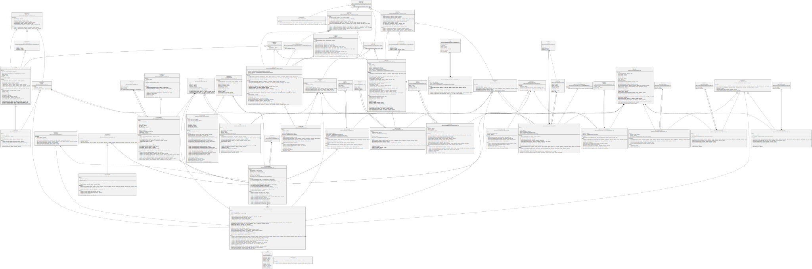

# TSCS - A Blockchain-Based Tokenized Subtitle Crowdsourcing System

## Install Dependencies

`git clone https://github.com/LaplaceMan/tscs-contracts`

`npm install`

## Compile Contracts

`npx hardhat compile --force`

## Deploy Contracts

`npx hardhat run scripts/deploy.js --network <network-name>`

> 先部署 TSCS 主合约 SubtitleSystem.sol ，构造函数输入参数为 DAO 合约地址
> 然后部署代币合约 VT.sol 和 Zimu.sol ，构造函数输入参数为主合约地址
> 最后部署策略合约 AccessStrategy.sol（访问权限策略）、AuditStrategy.sol（审核策略）、DetectionStrategy.sol（相似度检测策略）和三个结算策略合约。其中，结算策略合约构造函数输入参数为主合约地址，其余为 DAO 合约地址

## Error Explain

| Label | Explain                |
| ----- | ---------------------- |
| ER0   | Already Exists         |
| ER1   | Invaild Data           |
| ER2   | Not Existence          |
| ER3   | State Changed          |
| ER4   | Have Evaluated         |
| ER5   | No Permission          |
| ER6   | Not Support            |
| ER7   | GAM Only One-time      |
| ER9   | Language Inconsistency |
| ER10  | High Similarity        |
| ER11  | Invalid Settlement     |

## Contracts UML Diagram

## Next Update

- [ ] 添加制作字幕手续费（手续费收取逻辑的模块化）
- [ ] 使用 Zimu 代币兑换 NFT，NFT 的差异化设计
- [ ] Zimu 代币的经济模型（使用途径）
- [ ] DAO 管理
- [ ] 仲裁（法庭）机制
- [ ] 字幕组 DAO
- [ ] 粉丝空投奖励

## Test Function Task

### Function In **SubtitleSystem.sol**

- [ ] submitApplication
- [ ] createVideo
- [ ] uploadSubtitle
- [ ] updateUsageCounts
- [ ] evaluateSubtitle
- [ ] preExtractMode0
- [ ] preExtract
- [ ] withdraw
- [ ] cancel
- [ ] recover

### Function In **EntityManager.sol**

- [ ] registerLanguage
- [ ] userJoin

### Function In **PlatformManager.sol**

- [ ] platfromJoin
- [ ] platformRate

### Function In **VideoManager.sol**

- [ ] updateViewCounts
