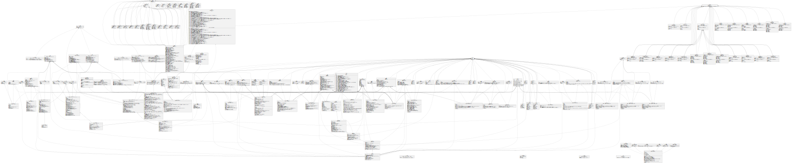

 

<h1>MURMES</h1>

TSCS: A Blockchain-Based Tokenized Subtitle Crowdsourcing System (Old Name)

## Install Dependencies

`git clone https://github.com/LaplaceMan/tscs-contracts`

`npm install`

## Compile Contracts

`npx hardhat compile --force`

## Deploy Contracts

`npx hardhat run scripts/deploy.js --network <network-name>`

> 先部署 Murmes (TSCS) 主合约 Murmes.sol ，构造函数输入参数为 DAO 合约地址
> 然后部署代币合约 VT.sol 、Zimu.sol、ST.sol 、Vault.sol、Platforms.sol，构造函数输入参数为主合约地址（和 DAO 合约地址）
> 最后部署策略合约 AccessStrategy.sol（访问权限策略）、AuditStrategy.sol（审核策略）、DetectionStrategy.sol（相似度检测策略）和三个结算策略合约。其中，结算策略合约构造函数输入参数为主合约地址，其余为 DAO 合约地址

## Test Contracts

`npx hardhat test .\scripts\<Test script>.js --network <Network name>`

## Verify Contracts

`npx hardhat clean`

`npx hardhat verify --constructor-args .\scripts\<constructor arguments>.js --network goerli <On-chain contract address>`

> 将代码上传到 ehterscan 或其它区块链浏览器，即使在翻墙的情况下也可能出现超时或无法连接的情况，可参考 [文章](https://learnblockchain.cn/question/2939)。

## Error Explain

| Label | Explain                |
| ----- | ---------------------- |
| ER0   | Already Exists         |
| ER1   | Invaild Data           |
| ER2   | Not Existence          |
| ER3   | State Changed          |
| ER4   | Have Evaluated         |
| ER5   | No Permission          |
| ER6   | Not Support            |
| ER7   | GAM Only One-time      |
| ER9   | Language Inconsistency |
| ER10  | High Similarity        |
| ER11  | Invalid Settlement     |

## Contracts UML Diagram

## Next Update

- [ ] 使用 Zimu 代币和 VT 代币兑换 NFT
- [ ] DAO 管理
- [ ] 仲裁（法庭）机制
- [ ] 字幕组 DAO
- [ ] 粉丝空投奖励
- [ ] SBT 设计
- [ ] 字幕的版本控制
- [ ] 当被确认字幕是恶意字幕，仲裁发出后的惩罚逻辑

# Token Economics

1. **VT(Video Token)**
   - ERC1155 标准
   - 由平台为各自发行的稳定币价值作背书
   - 当支付策略与在视频平台的收益相绑定时，利益相关者获得的是由相应平台发行的稳定币
   - ID 为 0 的 VT 是一种特殊的通胀型代币，用户每次发布申请时都会获得与当前信誉度一致的代币数量，它的获取途径唯一，使用途径目前设计为兑换 NFT，且兑换时会燃烧
2. **Zimu(Zimu Token)**
   - ERC20 标准
   - Murmes (TSCS) 发行的通缩型平台代币，总量为 10 亿个，精度为 18
   - 当用户参与社区建设（字幕被确认时，字幕制作者和相应的审核员）时获得代币奖励 20%
   - 用户兑换 NFT 时不仅需要消耗一定数量的 ID 为 0 的 VT，还需要质押一定数目的 Zimu 代币
   - 基于信誉度和代币质押双重验证机制，用户注册或因信誉度过低补充质押代币时，需要使用该代币
   - 因用户恶意行为扣除的 Zimu 代币将保留在金库中，一部分用于仲裁时奖励仲裁成功的发起人和受害者，存在存储最大值，多余的将用于社区奖励
   - 当结算策略为默认的一次性策略时，仅能使用该代币支付
   - 该代币是平台内的治理代币，可参与手续费用分红
   - 35% 公开售卖 30% 团队发展 15% 初期空投奖励 20% 社区激励
3. **ST(Subtitle Token)**
   - ERC721 标准
   - 用户上传字幕时自动生成
   - 用户可根据已上传的 ST（出于安全性，会有其它限制：申请已被确认且经过审核期）、 Zimu 代币和 ID 为 0 的 VT 生成 NFT
4. **SBT**
   - ERC721 未来计划
   - 为优秀的字幕制作者或深度用户（审核员、视频创作者）发放灵魂绑定代币或提供兑换服务（需要燃烧一定数目的 ID 为 0 的 VT 代币）
   - 基于 SBT 设计奖励策略
5. **双代币模型**
   - Murmes (TSCS) 内的主要功用代币是 Zimu，它总量有限且用途广泛（发起策略为一次性结算的申请、兑换 NFT、用户加入时的质押、参与治理和分红），应当是具有升值空间的
   - ID 为 0 的 VT 的引入是为了弥补申请者的交易 gas 费用，它的价值由获取唯一性和用途（兑换 NFT 和 SBT）来保证，而无限增发和用途相对单一则限制了它过高的价值，这是我们所希望的，因为需要一种低成本的回馈用户的方式（兑换粉丝向 NFT 和 具有身份象征意义的 SBT 应该是廉价的行为）

## Deployed Contracts

### Goerli - 0x5

| Name                               | Contract Address                           |
| ---------------------------------- | ------------------------------------------ |
| Murmes                             | 0xD18bD5B3439c7994988534F2Bdbb64A0556085BB |
| Zimu Token                         | 0x195D1F8BC906f1129a1Ab177E7536CAe9b7E142b |
| Video Token                        | 0xF0D5f127AC8e8582a2C3fE228203c1015c397d3E |
| Subtitle Token                     | 0x223dbc19cA1636cCd044F8eef5c0d829fA632C4c |
| Vault Manager                      | 0xE9aF9E85E0D3aD5c38Fb3cd71fecAb694030787e |
| Platform Manager                   | 0xcf757954A689834dE86182476E38e22A3fE645d4 |
| Access Strategy                    | 0x8bA47eBcc3877ddE208de5abE5a5Cb973CF44437 |
| Audit Strategy                     | 0xb3963a71d52E6270Bc6C066fC36DB94B20F6fE92 |
| Detection Strategy                 | 0x90b2573320191040E05471FECE0305cDd6700cB2 |
| Settlement-Divide (DR1)            | 0x2c7EFFBc537E3a9404d0637297C6E3C22Ee00217 |
| Settlement-Onetime (OT0)           | 0x61F10AbA9e6087c1EA315d1651BF09977ee466d7 |
| Settlement-Onetime Mortgage (OTM2) | 0xbBdD22dFE991F5366AC6895B18c6A2Fe11c892f1 |
